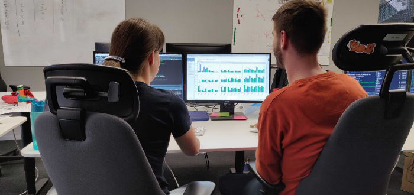

Pair programming is a well known concept in software development, however it is not that widespread with Data Scientist. At Emarsys we almost always work in pairs. Check out [my blogpost](https://blog.craftlab.hu/pair-datasciencing-5e74d0386448) at Emarsys Craftlab, why I think that Data Science teams should do pair programming!

