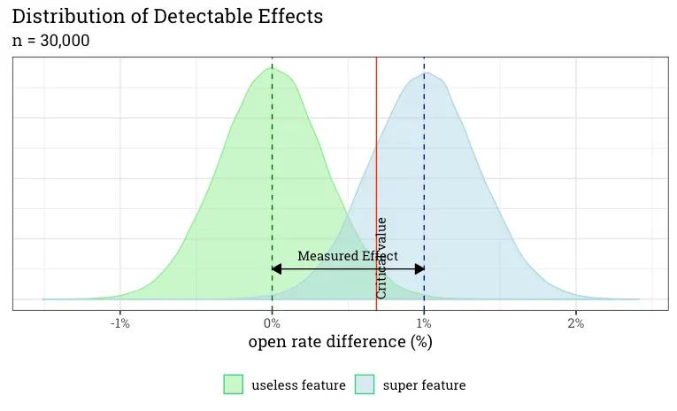

Not long ago I saw this [A/B testing brain teaser by Ron Kohavi](https://www.linkedin.com/posts/ronnyk_test-your-intuition-on-p-values-you-design-activity-7136272639823663104-H7u8/):

"Test your intuition on p-values?
You design an A/B test to detect a relative effect of at least 5% (MDE) to your conversion rate using industry recommended parameters: alpha=0.05 (5% type-I error) and 80% power (20% type-II error).

When the experiment finishes and reaches the planned number of users per above, you see that the treatment effect is exactly 5%.

What will be the p-value?"

Maybe your first intuition would be 0.05, because that's how the experiment is designed, but let's dig into it and check if it is really the case.

# Quick recap on the Minimum Detectable Effect

'Obviously' there is a catch and it is not too complicated either, you just need to understand what the Minimum Detectable Effect (MDE) is and how it relates to the setup of the experiment.

I actually wrote a blogpost about the MDE a while ago ([check it out!! :)](https://blog.craftlab.hu/checking-both-sides-the-minimum-detectable-effect-f34a6c0db4fb)), but in short: it is the Minimum Effect we can expect to measure (as a statistically significant effect) with a given setup for an experiment. I did write a 'footnote' however, which is key to answer the question:
"Actually this is not totally true since the MDE shows the **mean difference** between two samples. It is possible that the Measured Effect is slightly smaller than the MDE but our results are still statistically significant."

When we are comparing the difference of two samples in a hypothesis test, we are actually comparing the **distribution** of potential effects we could measure if the null or the alternative hypothesis is true. Since the MDE actually is a point value for the mean difference between two samples, it is possible that a somewhat smaller effect is still statistically significant. Turning it around: to make sure our experiment has enough power, we need to make sure the distribution for the alternative hypothesis is 'far enough' from the null distribution, which makes the MDE (the mean of the alternative distribution) even a bit further.



# What is the p-value for our brain teaser?

The scenario described above is quite simple, since we are using binary outcomes, so we can easily calculate the p-value for our brain teaser.

One way to is to write a simple script:

```R
# library(ggplot2)

variation_a <- 0.03 # can be other value of course as base rate is not stated in question
relative_effect <- 1.05
variation_b <- variation_a * relative_effect

sample_size_per_variation <- 207935 # can use online calculators or write simple function for it

pooled_se <- sqrt(
    (variation_a * (1 - variation_a) / sample_size_per_variation) +
    (variation_b * (1 - (variation_b)) / sample_size_per_variation)
)

prob <- pnorm(variation_b - variation_a, mean = 0, sd = pooled_se)

# assuming two-sided test
p_value <- (1 - prob) * 2
paste("p-value:", round(p_value, 4))
```

In the script above we have a normal distribution (`pnorm`), where the mean is 0. This is representing the null hypothesis, that there is no difference between the two groups. We calculate the p-value: how 'far on the edge' is such difference between two groups (variation_b - variation_a) on this distribution?

# Conclusion

After running the script, we get that the p-value is about 0.005, so it **10 times less** than the 5% significance level set by the experiment!

My take on this exercise is that:

1. P-value is again proved to be hard to understand and interpret, so relying only on p-values can really derail any experiment.

2. People are not as good as math/probability related intuition as they might think. I think most people know this deep in their heart, but still they get suprised by similar examples, so it is good to remind ourselves time to time.

# +1: an even easier way to calculate the p-value

Actually we don't even need code with the examples to calculate. I wanted to show that, becuase I think it makes understanding easier.

The task is actually to find how far is the alternative hypothesis distribution mean (MDE) from the null hypothesis distribution mean.

With a 5% alpha we 'know' (or look it up, eg.: `qnorm(0.975)`) that the critical value is at 1.96 standard deviations from the mean.

With a 80% power, the critical vallue is placed at the 20th percentile (1 - 0.8). This means that it is ~0.84 standard deviations away from the mean of the alternative hyptothesis's distribution.

This means, that we are looking for a p-value for the null hypothesis, which is 1.96 + 0.84 = 2.8 standard deviations away. This translates to a p-value of 0.005:

```R
total_distance <- qnorm(0.975) + abs(qnorm(0.2))
(1 - pnorm(total_distance, mean = 0)) * 2
```

The above calculations doesn't always work out this simple (eg.: outcome is not binary, standard errors are not equal, etc.), but in this case I think it is a pretty simple and elegant way to solve the problem.